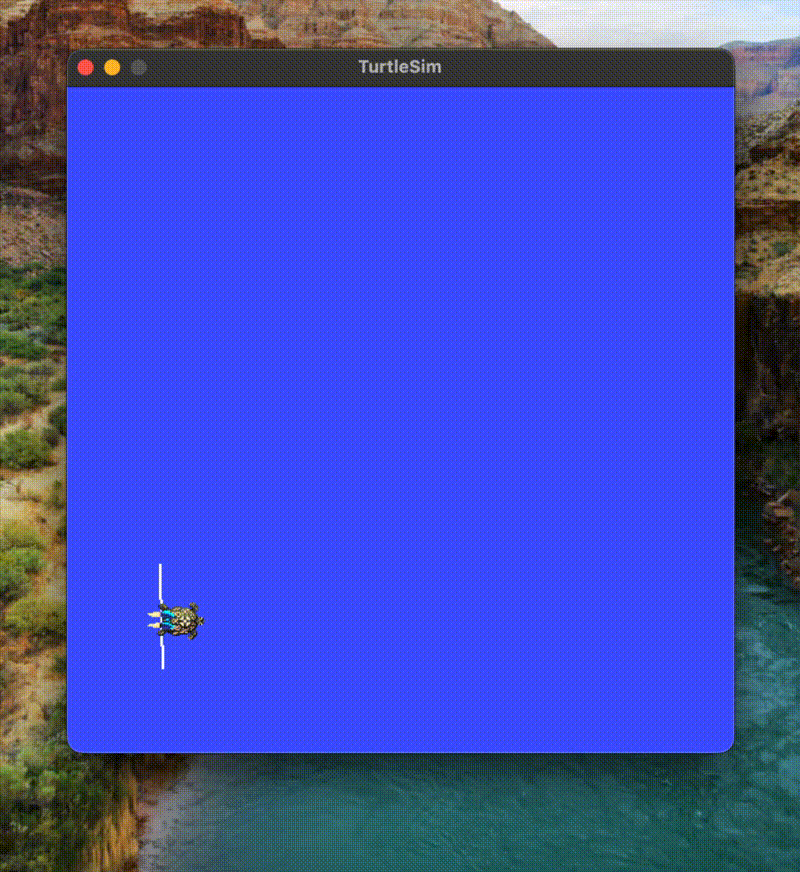

# turtle_writer

A ROS2 package that draws names in turtlesim using a coordinate-based letter system. The turtle draws each letter using velocity-controlled strokes and teleports between positions for precise repositioning.



## What It Does

Pass any name as a launch argument and the turtle draws it letter by letter on the turtlesim canvas. Letters are defined as sequences of coordinates with pen on/off flags, making it easy to add new characters.

## Concepts Demonstrated

- ROS2 publishers, subscribers, and service clients in C++
- Feedback-based movement control using pose subscription
- Teleport service for exact pen-up repositioning
- Custom threading architecture (drawing thread + executor thread)
- ROS2 parameters and launch file argument passing
- CMake dependency management for a multi-dependency package

## Requirements

- ROS2 Humble
- turtlesim (`ros-humble-turtlesim`)

## Build

```bash
cd ~/writing_turtle
colcon build --packages-select turtle_writer --symlink-install
source install/setup.bash
```

## Run

Draw the default word (HI):
```bash
ros2 launch turtle_writer draw.launch.py
```

Draw a custom name:
```bash
ros2 launch turtle_writer draw.launch.py name:=HELLO
```

## Supported Letters

`H`, `E`, `L`, `O`, `I`

New letters can be added in `main()` inside `turtle_writer_node.cpp` by adding an entry to the `letters` map. Each letter is defined as a list of `{x, y, pen}` coordinates relative to the letter's origin, where `pen=1` draws to that point and `pen=0` teleports to it.

Example — the letter I:
```cpp
{'I', {{0,0,0},{0,3,1}}}
```
This teleports to the bottom of the letter, then draws up 3 units.

## Package Structure

```
turtle_writer/
├── CMakeLists.txt
├── package.xml
├── launch/
│   └── draw.launch.py
└── src/
    └── turtle_writer_node.cpp
```

## How It Works

Movement uses a feedback loop that publishes velocity commands and checks the turtle's actual pose on each iteration, stopping when the target distance is reached. Turns use incremental delta tracking with wrap-around handling to correctly handle angles crossing the ±π boundary. Pen-up repositioning uses the `/turtle1/teleport_absolute` service for zero-error positioning.
